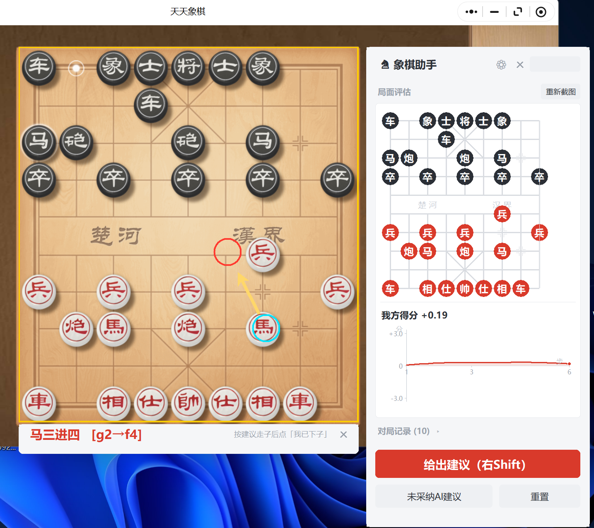
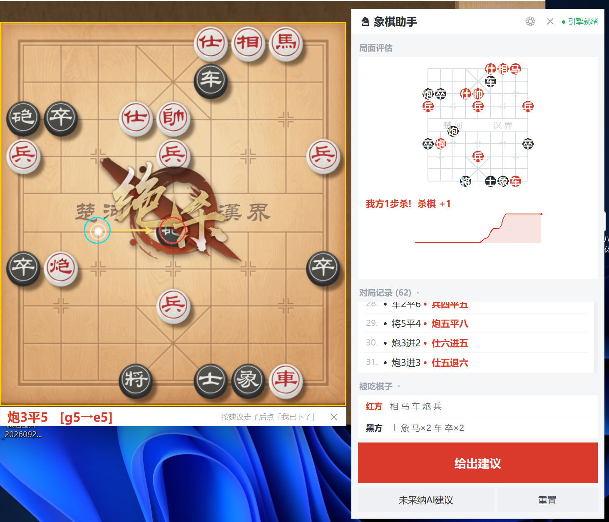
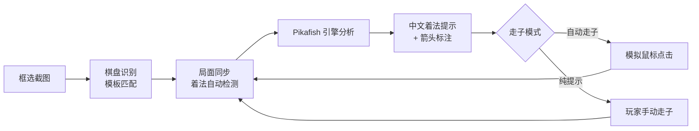
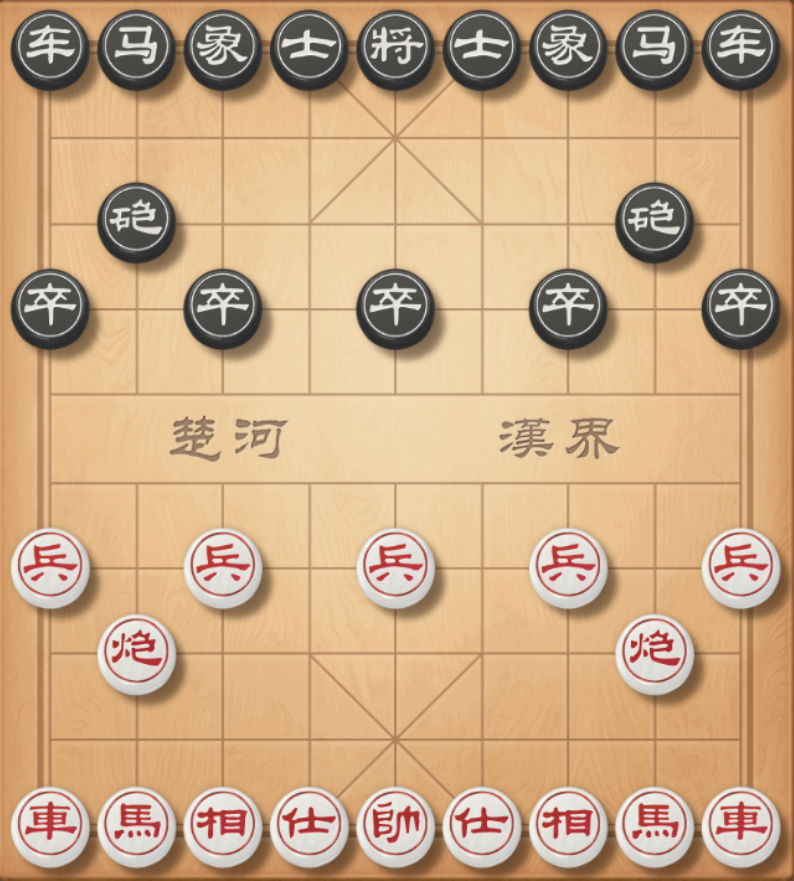
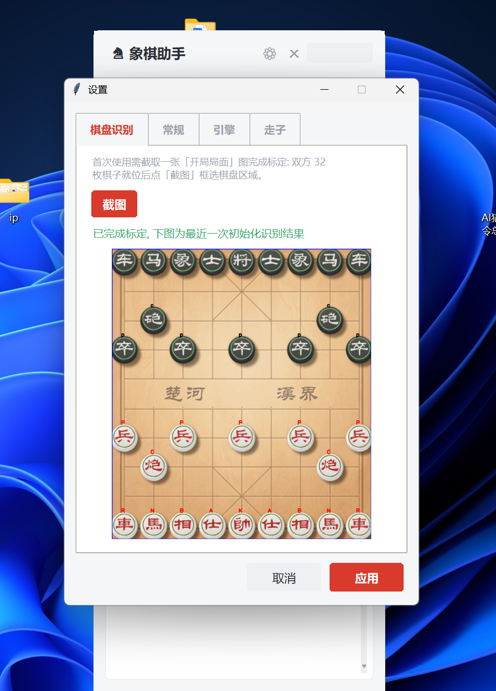

<div align="center">


# XiangqiCopilot

**基于棋盘视觉识别与皮卡鱼引擎的象棋智能对弈助手**


截图自动识别棋盘 · 内置最强开源引擎 · 中文着法提示 · 支持自动走子

</div>

---

## 📸 效果预览

|            对弈辅助            |              成功绝杀               |
| :----------------------------: | :---------------------------------: |
|  |  |

> 悬浮面板实时显示局面评估曲线、对局记录与被吃棋子；引擎建议以「中文着法 + UCI 坐标」呈现，并在棋盘上用圆圈与箭头标出起点、落点。

## ✨ 功能特性

- 🔍 **自动棋盘识别** — 全屏框选截图，基于模板匹配自动识别双方 32 枚棋子，无需手动输入局面
- 🧠 **内置最强开源引擎** — 内置 [Pikafish（皮卡鱼）](https://github.com/official-pikafish/Pikafish)，UCI 协议驱动，支持思考时间 / 搜索深度 / 线程数 / 置换表自定义
- 🖱️ **支持自动走子** — 给出建议后自动模拟鼠标点击起点与落点，无需手动操作（也可切换为纯提示模式）
- 📈 **实时局面评估** — 评估曲线图 + 当前得分，直观呈现局势走向与杀棋信号
- 🀄 **中文着法提示** — 「马三进四 [g2→f4]」双格式提示，悬浮窗 + 棋盘箭头标注
- 📜 **完整对局记录** — 自动同步双方着法，记录中文棋谱与被吃棋子统计
- 🪟 **从容的桌面体验** — 可拖动悬浮面板、DPI 自适应、截图时自动隐藏标注、多显示器支持

## 🧩 工作原理



## 📦 安装指南

### 环境要求

| 项目     | 要求                                     |
| :------- | :--------------------------------------- |
| 操作系统 | Windows 10 / 11                          |
| Python   | 3.8 及以上                               |
| 游戏平台 | 天天象棋（微信小程序，需在主显示器打开） |

### 安装步骤

```bash
# 1. 克隆仓库
git clone https://github.com/你的用户名/XiangqiCopilot.git
cd XiangqiCopilot

# 2. 安装依赖
pip install opencv-python numpy pillow
```

> 💡 仓库 `engine/` 目录已内置 Pikafish 引擎（`pikafish-avxvnni.exe` + NNUE 权重），开箱即用。
> 如需更新引擎或获取其他 CPU 指令集版本，请前往 [Pikafish Releases](https://github.com/official-pikafish/Pikafish/releases) 下载。

## 🚀 初始化指引（首次使用必读）

首次使用需要完成一次**棋盘标定**，让程序认识你的棋盘与棋子样式。全程约 1 分钟：

**第 1 步** — 在天天象棋中进入一个**开局局面**（双方 32 枚棋子全部就位，如下图）：



**第 2 步** — 运行程序：

```bash
python auto_play.py
```

**第 3 步** — 首次启动时悬浮面板会显示截图引导，点击 **【初始化配置】** 进入设置页的「棋盘识别」选项卡，点击 **【截图】** 后框选完整的棋盘区域。

**第 4 步** — 程序自动完成标定与识别，显示带棋子标签的标注图与识别结果：



**第 5 步** — 确认标注图中的棋子识别无误后，点击 **【应用】** 保存。标定结果保存在 `settings/calibration.json` 与 `templates/` 中，之后无需重复标定。

> 💡 标定提示
>
> - 请确保截图框选**完整棋盘**（含边框），不要多选或漏选
> - 若识别结果有误，重新截图框选一次即可
> - 更换皮肤 / 分辨率后建议重新标定

## 🎮 使用方法

### 启动命令

```bash
python auto_play.py                 # 默认：自动识别执子颜色
python auto_play.py --side red      # 指定我方执红
python auto_play.py --side black    # 指定我方执黑
```

### 命令行参数

| 参数         | 默认值   | 说明                                     |
| :----------- | :------- | :--------------------------------------- |
| `--side`     | `auto`   | 我方执子颜色（`red` / `black` / `auto`） |
| `--engine`   | 自动查找 | UCI 引擎路径                             |
| `--movetime` | `1000`   | 引擎思考时间（毫秒）                     |
| `--depth`    | `0`      | 搜索深度（0 = 按思考时间搜索）           |
| `--threads`  | `4`      | 引擎线程数                               |
| `--hash`     | `256`    | 置换表大小（MB）                         |
| `--thr`      | `0.55`   | 棋子识别阈值                             |
| `--debug`    | 关闭     | 每次截图保存识别标注图，便于排查问题     |

### 对弈流程

1. 点击 **【截图】** 框选棋盘，识别当前局面
2. 按下 **右 Shift**（或点击 **【给出建议】**），引擎计算并以中文着法提示
3. 若开启自动走子，程序自动点击落子；否则按提示手动走子
4. 走子后局面自动同步；若未按建议走子，点击 **【未采纳AI建议】** 手动同步

> 引擎参数、走子模式、快捷键均可在悬浮面板的 **设置** 中调整。

## 🙏 致谢

- [Pikafish（皮卡鱼）](https://github.com/official-pikafish/Pikafish) — 强大的 UCI 象棋引擎，本项目的分析核心
- [天天象棋](https://www.tencent.com/) — 游戏平台

## ⚠️ 免责声明

本项目仅供学习交流与技术研究中使用，请勿用于任何违反游戏规则或法律法规的场景。使用本工具产生的一切后果由使用者自行承担。
